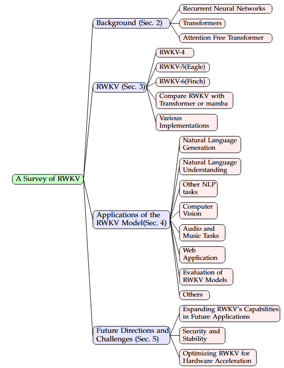

<div align="center">
  <br>
  A collection of papers and resources related to a survey of RWKV.
</div>
<br>
 
<p align="center">
  Zhiyuan Li<sup>*1</sup>&nbsp&nbsp
  Tingyu Xia<sup>*1</sup>&nbsp&nbsp
  Yi Chang<sup>1</sup>&nbsp&nbsp
  Yuan Wu<sup>#1</sup>&nbsp&nbsp
</p>  
<p align="center">
<sup>1</sup> Jilin University<br>
(*: Co-first authors, #: Corresponding author)
</p>

# Papers and resources for RWKV

The papers are organized according to our survey: [A Survey of RWKV](). 

**NOTE:** As we cannot update the arXiv paper in real time, please refer to this repo for the latest updates and the paper may be updated later. We also welcome any pull request or issues to help us make this survey perfect. Your contributions will be acknowledged in <a href="#acknowledgements">acknowledgements</a>.

Related projects:
- RWKV-IR: [[Exploring Real&Synthetic Dataset and Linear Attention in Image Restoration](https://arxiv.org/abs/2412.03814)]



<details>
  <summary>Table of Contents</summary>
  <ol>
    <li><a href="#news-and-updates">News and Updates</a></li>
    <li><a href="#RWKV">RWKV</a></li>
    <li>
      <a href="#applications-of-the-rwkv-model">Applications of the RWKV model</a>
      <ul>
        <li><a href="#natural-language-generation">Natural Language Generation</a></li>
        <li><a href="#natural-language-understanding">Natural Language Understanding</a></li>
        <li><a href="#other-nlp-tasks">Other NLP tasks</a></li>
        <li><a href="#computer-vision">Computer Vision</a></li>
        <li><a href="#web-application">Web Application</a></li>
        <li><a href="#evaluation-of-rwkv-models">Evaluation of RWKV Models</a></li>
        <li><a href="#others">Others</a></li>
      </ul>
    </li>
    <li><a href="#Contributing">Contributing</a></li>
    <li><a href="#citation">Citation</a></li>
    <li><a href="#acknowledgements">Acknowledgments</a></li>
  </ol>
</details>

## News and updates

- [XX/XX/2024] The first version of the paper is released on arXiv: [A Survey of RWKV]().

## RWKV

1. RWKV: Reinventing RNNs for the Transformer Era 2023.[[paper](https://arxiv.org/abs/2305.13048)]
2. Eagle and Finch: RWKV with Matrix-Valued States and Dynamic Recurrence 2024. [[paper](https://arxiv.org/abs/2404.05892)]
3. RWKV official repositorie [[project](https://github.com/BlinkDL/RWKV-LM)]

## Applications of the RWKV model
### Natural Language Generation

1. Combining information retrieval and large language models for a chatbot that generates reliable, natural-style answers. [[paper](https://ceur-ws.org/Vol-3630/LWDA2023-paper27.pdf)]
2. AI-Writer [[project](https://github.com/BlinkDL/AI-Writer)]
3. RWKV chatbot [[project](https://github.com/harrisonvanderbyl/rwkv_chatbot)]
4. RWKV wechat bot [[project](https://github.com/averyyan/RWKV-wechat-bot)]
5. RWKV chat command line [[project](https://github.com/az13js/rwkv_chat_command_line)]
6. A QQ Chatbot based on RWKV [[project](https://github.com/cryscan/eloise)]
7. Local lightweight chat AI based on RWKV [[project](https://github.com/bilibini/Meow-AI)]
8. Espritchatbot RASA RWKV [[project](https://github.com/kimou6055/Espritchatbot-RASA-RWKV)]
9. Espritchatbot RASA RAVEN [[project](https://github.com/karim-aloulou/Espitchatbot-RASA-RAVEN)]
10. RAG system for RWKV [[project](https://github.com/AIIRWKV/RWKV-RAG)]
11. ChatRWKV in wechat [[project](https://github.com/MrTom34/ChatRWKV-in-wechat-Version-1)]
12. Generating WeChat replies using the RWKV runner [[project](https://github.com/LeoLin4258/Infofusion)]
13. RWKV-Drama [[project](https://github.com/ms-KuroNeko/RWKV-Drama)]
14. RWKV Role Playing with GPT SoVITS [[project](https://github.com/v3ucn/RWKV_Role_Playing_with_GPT-SoVITS)]
15. A Telegram LLM bot [[project](https://github.com/spion/notgpt)]
16. Chatbots based on nonebot and RWKV [[project](https://github.com/123summertime/ykkz)]
17. Online chat rooms based on PyWebIO and RWKV models [[project](https://github.com/No-22-Github/Easy_RWKV_webui)]
18. Android RWKV MIDI [[project](https://github.com/ZTMIDGO/Android-RWKV-MIDI)]
19. Use RWKV to generate symbolic music to a text file. [[project](https://github.com/patchbanks/RWKV-v4-MIDI)]
20. Use the RWKV-4 music model to generate the texture and music [[project](https://github.com/agreene5/Procedural-Purgatory)]

### Natural Language Understanding

### Other NLP tasks

### Computer Vision

### Web Application

### Evaluation of RWKV Models

### Others


## Contributing

We welcome contributions to RWKV-survey! If you'd like to contribute, please follow these steps:

1. Fork the repository.
2. Create a new branch with your changes.
3. Submit a pull request with a clear description of your changes.

You can also open an issue if you have anything to add or comment.

## Citation

If you find this project useful in your research or work, please consider citing it:
```
@article{li2024survey,
      title={A Survey of RWKV}, 
      author={Li, Zhiyuan and Xia, Tingyu and Chang, Yi and Wu, Yuan},
      journal={arXiv preprint arXiv:XXXX},
      year={2024}
}
```

## Acknowledgements
